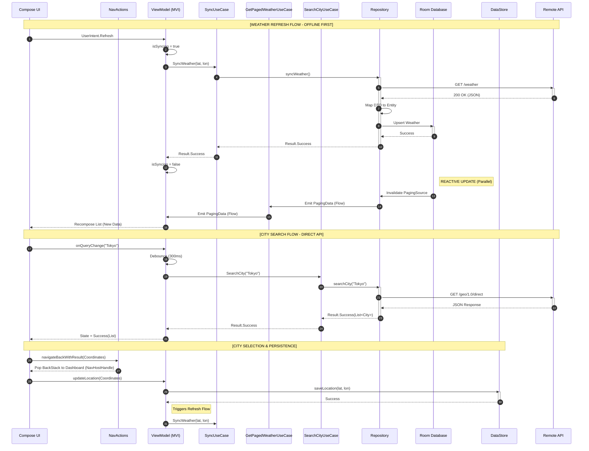
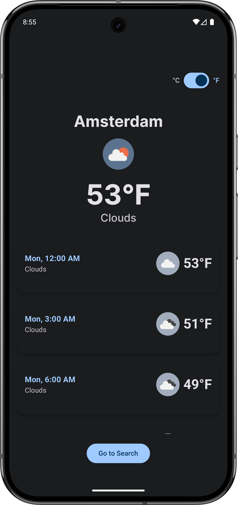
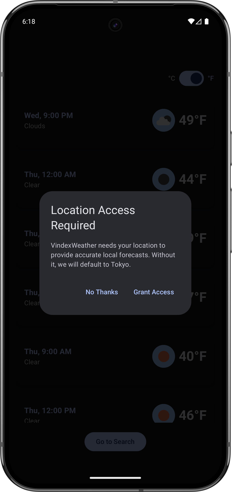
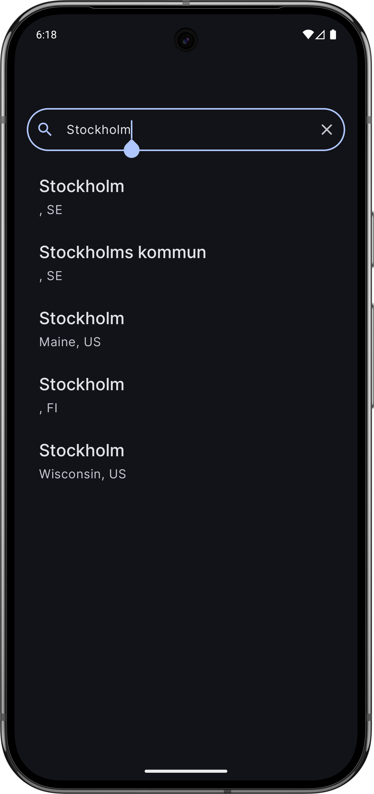
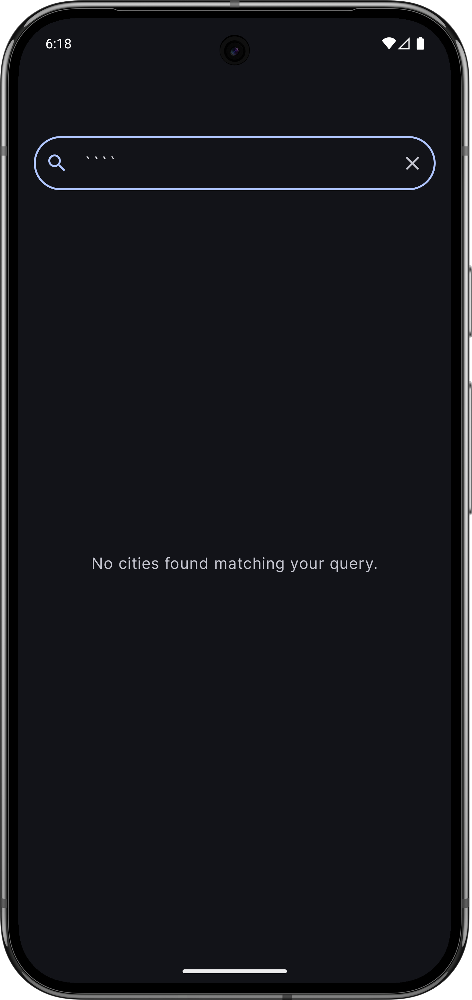
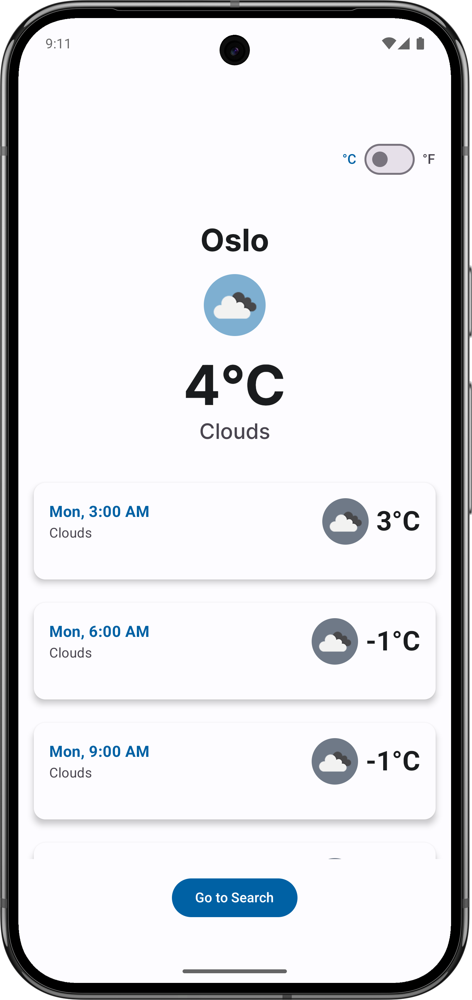
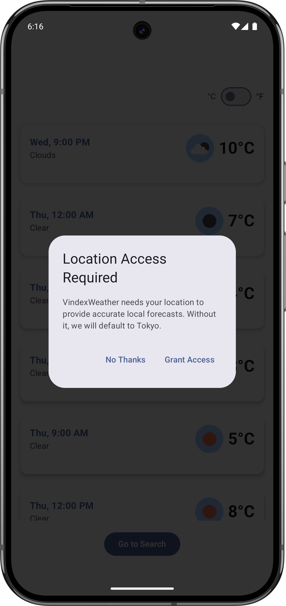
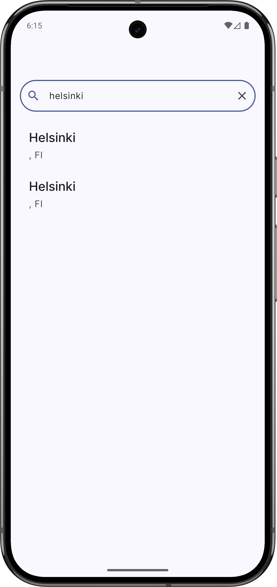
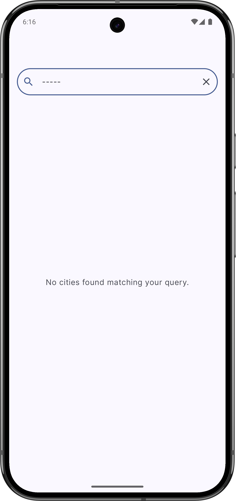

[](https://github.com/miggymamba/VindexWeather/actions/workflows/ci.yml)

# Vindex Weather

**Vindex Weather** is an Android application built to demonstrate a production-ready approach to handling unstable network conditions, complex UI states, and background synchronization in a modern mobile environment.

Rather than treating a weather app as a simple API fetcher, this project approaches it as a study in **High-Availability Offline-First** architecture. It prioritizes data consistency, single source of truth (SSOT) patterns, and seamless recovery from process death or network fragmentation. The codebase prioritizes maintainability, strict separation of concerns, and verifiable correctness through testing.

## Key Features

- **Offline-First Architecture:** The UI consumes data exclusively from the local database (Room). Network calls update the database, observing the "Single Source of Truth" principle.

- **Resilient Synchronization:** Background updates are managed via `WorkManager` with optimized constraints (UNMETERED + BATTERY NOT LOW). This balances keeping the offline cache fresh throughout the day while respecting the user's critical battery levels.

- **Reactive MVI:** UI state is managed via `StateFlow` and immutable data models, ensuring predictable rendering across configuration changes.

- **Adaptive Layouts:** Supports dynamic resizing for Foldables and Tablets using standard `WindowSizeClass` implementation.


## Technical Architecture

Following the [Now in Android](https://github.com/android/nowinandroid) philosophy, this project utilizes **Clean Architecture** with a layered approach to separate concerns and maximize testability.

### Layer Breakdown

The project follows a package-by-layer structure within a single module to cleanly separate concerns:

- **`app/`**: The entry point, containing `MainActivity` and global Hilt configuration.

- **`presentation/`**: Jetpack Compose UI, ViewModels, and UI state management.

- **`domain/`**: The "Brain." Contains pure Kotlin Business Logic, UseCases, and Repository interfaces. **No Android dependencies.**

- **`data/`**: Implementation of repositories, Retrofit services, and Room persistence. Handles the synchronization logic between Remote and Local data sources.


### Network & Sync Stack

- **Retrofit 3.0 / OkHttp 5:** Handling API communication with custom Interceptors for logging and error mapping.

- **Kotlin Serialization:** Type-safe, reflection-free JSON parsing.

- **WorkManager:** Guaranteed background execution for periodic weather synchronization.

- **Coil:** Coroutine-backed image loading pipeline for weather assets.


## What This Project Demonstrates

This project is intended as a practical demonstration of the following skills and design decisions:

- Implementing an Offline-First repository pattern where the UI never talks to the network directly

- Handling complex asynchronous streams using Kotlin Coroutines and Flow

- Managing large datasets efficiently using **Paging 3** (RemoteMediator pattern)

- Conscious handling of API rate limits using local caching and `debounce` strategies

- Writing unit tests that validate business logic (UseCases) and integration tests for the Repository layer

- Applying **industry-standard** build configuration using Version Catalogs and strict compiler flags


## Development Setup

1. Clone the repository.

2. Ensure you have the latest **Android Studio (Otter or later)**.

3. Obtain a free API Key from [OpenWeatherMap](https://openweathermap.org/api "null").

4. Create a `local.properties` file in the root directory and add:

    ```
    WEATHER_API_KEY=your_actual_key_here
    ```

5. Build the project.


## Testing Strategy

This project emphasizes meaningful unit testing over artificial coverage metrics.

- **Domain Layer:** 100% coverage of UseCases using MockK to verify business rules.

- **Data Layer:** `MockWebServer` is used to simulate network edge cases (404, 500, timeouts) to ensure the app handles failures gracefully without crashing.

- **UI Layer:** "Golden Path" automated tests using `ComposeTestRule` to verify critical user journeys.


## Non-Goals

This project intentionally does not aim to:

- Compete with commercial weather apps in terms of visual polish or animations

- Implement proprietary or paid weather data layers (strictly uses Free Tier endpoints)

- Support legacy Android views (strictly Jetpack Compose)


## Sequence Diagram



## Screenshots

### Dark Mode

|Feature|Screenshot|
|---|---|
|**Dashboard** (Main View)||
|**Location Permission** (Edge Case)||
|**Search Results**||
|**Empty Search** (Edge Case)||

### Light Mode

|Feature|Screenshot|
|---|---|
|**Dashboard** (Main View)||
|**Location Permission** (Edge Case)||
|**Search Results**||
|**Empty Search** (Edge Case)||

## Future Roadmap

- **Zero-Flicker Sync:** Optimization of `RemoteMediator` to use intelligent Upsert/Delete logic instead of `clearAll()` to eliminate UI flashes during data refreshes.

- **Screenshot Testing:** Integration of Roborazzi to verify UI regression across different device form factors (Foldable/Tablet).

- **Edge-to-Edge Polish:** Refinement of system bar transparency and content insets for a fully immersive UI.

- **Error Handling:** Implementation of a generic `PagedListWrapper` to map specific network exceptions to distinct Domain Errors.


## License

Vindex Weather is compliant with **Apache License 2.0**. See [LICENSE](https://github.com/miggymamba/VindexWeather/blob/main/LICENSE "null") for more information.